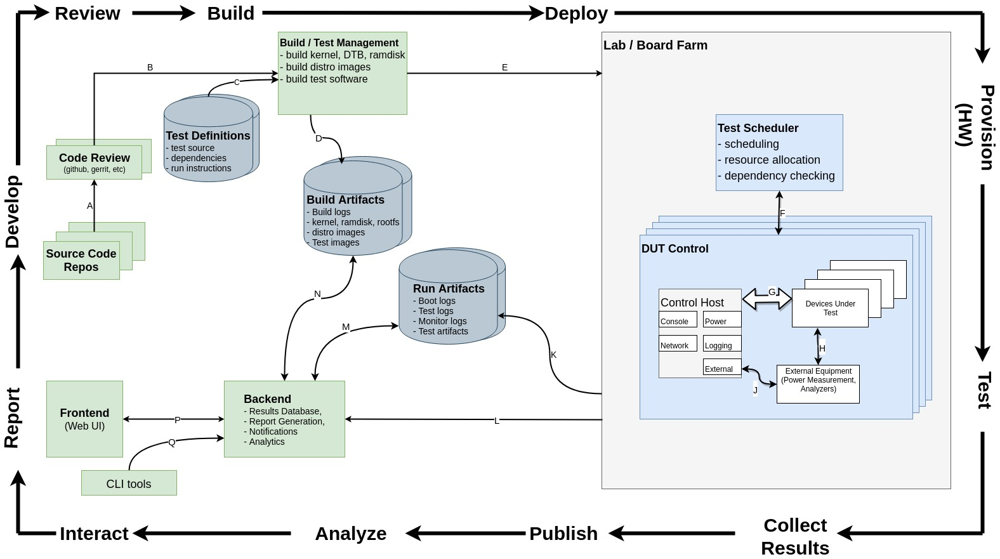

# Автоматизация тестирования

### Selenium

#### Selenium WebDriver

Что касается фреймворков для автоматических действий на веб странице, то существует интересный [**selenium**](https://www.selenium.dev/documentation/). При использовании данного фреймворка могут возникнуть трудности при поиске нужных полей/кнопочекм (XPath).\

Пример использования **selenium** совместно c **pytest** можно посиотреть [здесь](webapp-selenium/web_test_prog.py).\
***Примечание***: необходимо предварительно установить инструмент для автоматического тестирования веб-приложений [chromedriver](https://chromedriver.chromium.org/).

Гайды как привязать **Selenium** к `Robot Framework`

- [RobotFramework SeleniumLibrary](https://robotframework.org/SeleniumLibrary/SeleniumLibrary.html)
- [Robot Framework Tutorial with Selenium and Python](https://www.lambdatest.com/blog/robot-framework-tutorial/)
- [Robot Framework and Selenium Test Automation](https://www.browserstack.com/guide/robot-framework-and-selenium-tutorial#:~:text=The%20Selenium%20Robot%20framework%20is,enormously%20useful%20for%20automation%20testers)
- [Robot Framework: The Ultimate Guide to Running Your Tests](https://www.blazemeter.com/blog/robot-framework)
- [Udemu Course](https://www.udemy.com/course/test-automation-with-robot-framework-selenium-library/?utm_source=adwords&utm_medium=udemyads&utm_campaign=DSA_Catchall_la.EN_cc.ROW&utm_content=deal4584&utm_term=_._ag_88010211481_._ad_535397282061_._kw__._de_c_._dm__._pl__._ti_dsa-485138043266_._li_1028595_._pd__._&matchtype=&gclid=CjwKCAjwrranBhAEEiwAzbhNtdFJngKkRN-pjIOk_zSdVmpNiVUbxUdoNBsMfZfRHLgaahMc-aNGRBoCvggQAvD_BwE)

Попробовал расширение ([Katalon Recorder ](https://chrome.google.com/webstore/detail/katalon-recorder-selenium/ljdobmomdgdljniojadhoplhkpialdid/related)) для генерации кода для Selenium WebDriver, с помощью него можно экспортировать Python код. Выглядит так:
```python
class UntitledTestCase(unittest.TestCase):
    ...
    def test_untitled_test_case(self):
        driver = self.driver
        driver.get("http://localhost:8181/#en:processes")
        driver.find_element_by_xpath("//div[@id='root']/<XPath>").click()
        driver.find_element_by_xpath("//div[@id='root']/<XPath>").click()
        driver.find_element_by_xpath("//div[@id='root']/<XPath>").click()
        ...
```

#### Selenium IDE

Позволяет записать примитивные действия на веб странице и воспроизвести их. Описания хранятся в простом [JSON файле](webapp-selenium/selenium-ide/webapp_test.side).

Не очень стабильный инструмент, постоянно вылетает и не очень широкий фукционал.

### [Cypress](https://docs.cypress.io/guides/overview/why-cypress)

Одно из самых мощных и популярных решений для тестирования Веб-приложений. Однако тесты пишутся только на **JavaScript**. Имеет удобный Dashbord для управления и отслеживания тестов. Также можно найди сторонние плагины для него по записи действий на веб странице, например [Cypress Chrome Recorder](https://chrome.google.com/webstore/detail/cypress-chrome-recorder/fellcphjglholofndfmmjmheedhomgin/related)

В качестве локаторов используются:

- CSS Selector
- XPath (с помощью [плагина](https://github.com/cypress-io/cypress-xpath))

Однако для правильной работы надо писать что то типо регулярных выражений по поиску для таких атрибутов как **`type`**/**`id`**/**`name`**. Для составления выражений для локаторов можно использовать расширение [SelectorsHub](https://selectorshub.com/selectorshub/)

Имеет особенность ["Time Travel"](https://docs.cypress.io/guides/core-concepts/cypress-app#Time-traveling), которая позволяет делать скпиншоты тестируемого веб приложения во время тестирования на каждом шаге

Пример использования для просто тестирования авторизации в веб приложении можно посмотреть [здесь](webapp-cypress-test).

Плейлист с [видеоуроками](https://www.youtube.com/playlist?list=PLUDwpEzHYYLvA7QFkC1C0y0pDPqYS56iU) по Cypress

### [Playwright](https://playwright.dev/docs/intro)

Тот же *Cypress* только от Microsoft. Заявлена поддержка [Python](https://playwright.dev/python/docs/intro) с помощью `pytest-playwright` плагина.\
Есть [генератор тестов](https://playwright.dev/python/docs/codegen-intro). Выглядит многообещающе.

### [Splinter](https://splinter.readthedocs.io/en/latest/#)

Предоставляет общий высокоуровневый API поверх существующих инструментов автоматизации браузера, таких как Selenium.\
Якобы [должен](https://splinter.readthedocs.io/en/latest/why.html#example) упрощать код по сравнентю с Selenium.

Рекомендуется использовать совместно с библиотекой [pytest-splinter](http://pytest-splinter.readthedocs.io/)

### [Pylenium](https://docs.pylenium.io/)

> Bring the best of Selenium, Cypress and Python into one package.

Является смесью Selenium, библиотеки pytest и сам по себе являющийся оберткой для инструмента автоматического тестирования веб-приложений [**Cypress**](#cypress)

## Common Frameworks

На elinux можно найти описание множества [различных фреймворков](https://elinux.org/Test_Systems) для автоматиции тестирования, а также приведена общая [методология (стандартизация)](https://elinux.org/Test_Standards) тестирования и некий [FAQ](https://elinux.org/Test_Stack_Survey) по ней. 



Cтоит выделить следущие фреймворки:
1. **[Fuego Test system](https://fuego.readthedocs.io/en/latest/index.html) (bitbucket repository):**
    > Fuego is a test system specifically designed for embedded Linux testing. It supports automated testing of embedded targets from a host system, as it’s primary method of test execution.\
    > The quick introduction to Fuego is that it consists of a host/target script engine and over 100 pre-packaged tests. These are installed in a docker container along with a Jenkins web interface and job control system, ready for out-of-the-box Continuous Integration testing of your embedded Linux project.

2. **[labgrid](https://labgrid.readthedocs.io/en/latest/index.html) - Embedded board control Python library:**
   > labgrid is an embedded board control python library with a focus on testing, development and general automation. It includes a remote control layer to control boards connected to other hosts.\
   > The idea behind labgrid is to create an abstraction of the hardware control layer needed for testing of embedded systems, automatic software installation and automation during development. labgrid itself is not a testing framework, but is intended to be combined with pytest (and additional pytest plugins). Please see Design Decisions for more background information.

3. **[LAVA Software Community Project](https://master.lavasoftware.org/static/docs/v2/index.html) - (Community Project GitLab [repository](https://git.lavasoftware.org/lava/lava/)):**\
    LAVA (Linaro Automated Validation Architecture) - это проект с открытым исходным кодом для автоматизации тестирования встроенных систем на реальном или виртуальном оборудовании. Он предоставляет инфраструктуру и фреймворк для создания и выполнения тестов. 
    > LAVA is a continuous integration system for deploying operating systems onto physical and virtual hardware for running tests. Tests can be simple boot testing, bootloader testing and system level testing, although extra hardware may be required for some system tests. Results are tracked over time and data can be exported for further analysis.

4. **[TCF](https://intel.github.io/tcf/) (Test Case Framework):**
    > TCF provides support to automate any kind of steps that a human would do otherwise, typing in the console or issuing command line commands.\
    > It allows you to define test cases as well as define the conditions under which those tests should be executed. TCF can be used to test various aspects of embedded systems, including the kernel, drivers, and user applications.

5. **Yocto Project - test elements ([ptest](https://wiki.yoctoproject.org/wiki/Ptest)):**
   > Ptest (package test) is a concept for building, installing and running the test suites that are included in many upstream packages, and producing a consistent output format for the results.\
   > The test can be anything, from a simple shell script running a binary and checking its output to an elaborate system of test binaries and data files.


